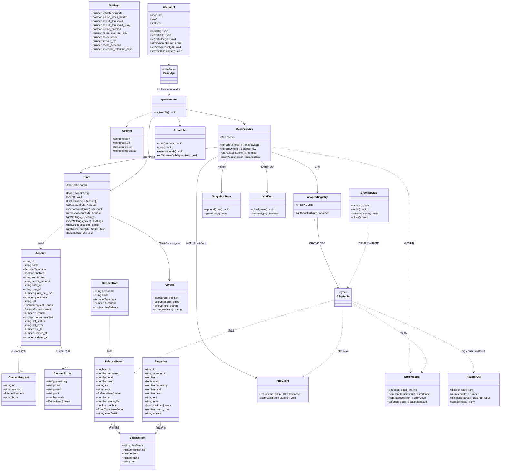
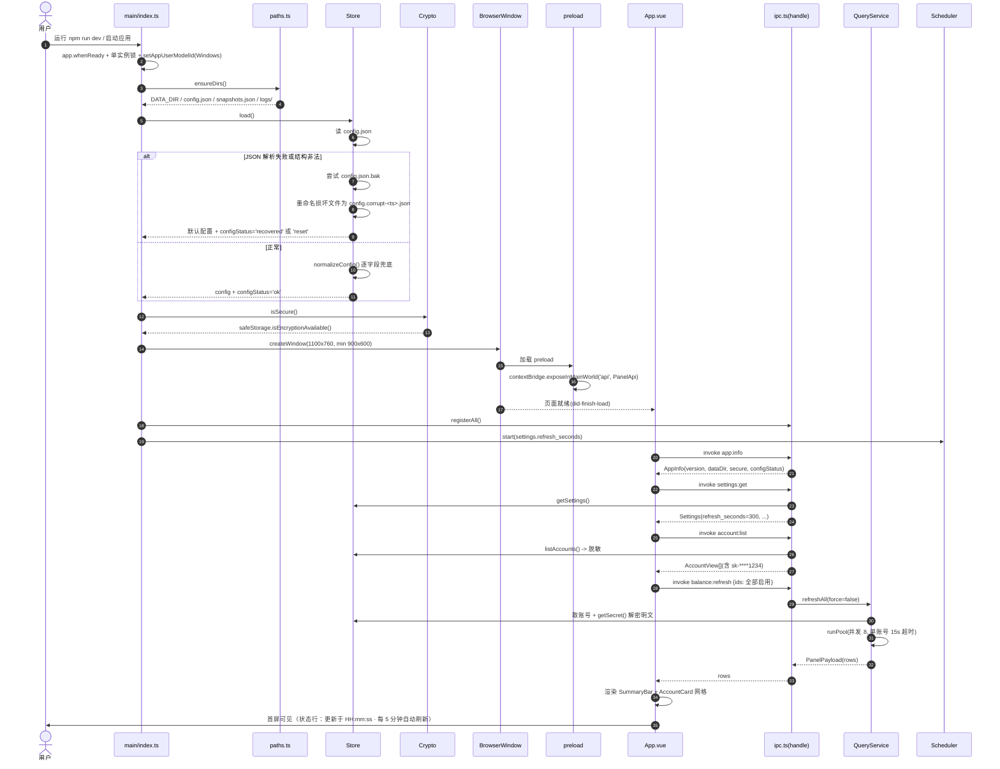
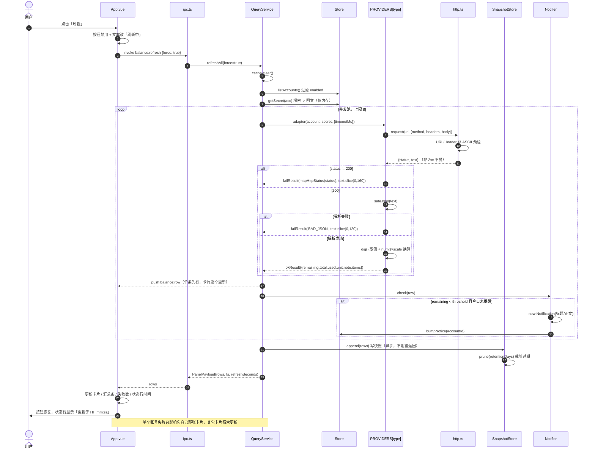
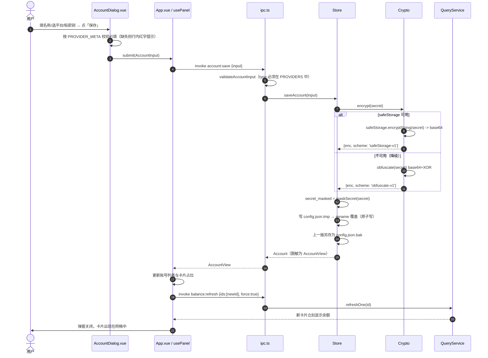
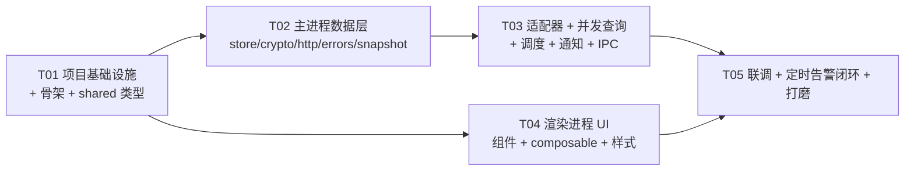

# API 余额监控面板 —— 系统架构设计 + 任务分解

| 项目信息 | 内容 |
|---|---|
| 文档语言 | 中文 |
| 项目根目录 | `E:\program\api-show\app`（新建，不动 `测试/`、`方案/`） |
| 技术栈 | Electron + Vue 3 + Vite（electron-vite 目录约定）+ TypeScript |
| 一期范围 | P0 全部（12 条）+ P1-1（低余额阈值告警） |
| 交付形态 | `npm run dev` 能跑起来、双击见界面；**不做安装包** |
| 运行环境 | Windows 11 / Node 22.22.2 / 国内网络（npmmirror 镜像） |
| 上游输入 | `docs/PRD.md`、`测试/server.py`、`测试/accounts.json`、`测试/web/index.html` |
| 适配器事实来源 | **一律以 `测试/server.py` 的 `p_deepseek / p_siliconflow / p_newapi / p_custom` 为准**，本文第 4.4 节逐条列出了移植对照 |

---

## 一、实现方案与框架选型

### 1.1 核心技术难点

| # | 难点 | 应对 |
|---|---|---|
| 1 | **密钥不能明文落盘、又不能让渲染进程拿到** | 只在主进程持有明文；磁盘存 `secretEnc`（safeStorage 加密）；preload 只回传 `sk-****1234` 掩码；渲染进程 `nodeIntegration: false` + `contextIsolation: true` |
| 2 | **多账号并发取数且互不影响** | 主进程自写 `runPool` 并发池（上限 8，无第三方依赖）+ 每账号独立 try/catch + 15s 超时 + 60s 缓存 |
| 3 | **各家接口字段千差万别** | 统一 `Adapter` 函数签名 + `PROVIDERS` 注册表；点号路径取值 `dig()`（原型移植）；新增平台 = 加一个文件 + 注册一行 |
| 4 | **报错要人话** | 集中错误映射表 `src/main/errors.ts`（错误码 → 中文文案），适配器只抛码不写文案 |
| 5 | **配置损坏不能白屏** | 原子写（tmp + rename）+ 单份 `.bak` + 读取失败自动回滚备份 + 归一化兜底 + 界面横幅提示 |
| 6 | **版本矩阵与国内网络** | 先锁版本再装（见 1.3、第 8 节）；`.npmrc` 内置 npmmirror registry 与 Electron 二进制镜像 |

### 1.2 框架选型与理由

| 项 | 选择 | 理由 / 说明 |
|---|---|---|
| 桌面壳 | **Electron ^44.2.0** | 需要 `safeStorage`（系统级加密，Windows 走 DPAPI）、`Notification`、真正的文件系统读写；Tarui 生态成熟度与 Node 原生模块便利性不如 Electron。44.2.0 为当前 latest |
| 构建 | **electron-vite ^5.0.0** | 官方推荐的 Electron + Vite 方案，天然三段（main/preload/renderer）构建与 `npm run dev` 热重载；内置 `externalizeDepsPlugin` |
| 打包器 | **Vite ^7.3.6**（**不能用 8.x**） | `electron-vite@5` 的 peerDependency 明确为 `vite: ^5 \|\| ^6 \|\| ^7`，Vite 8 会报 peer 冲突。7.3.6 是 7.x 最新稳定 |
| 前端框架 | **Vue ^3.5.42 + `<script setup>` 组合式 API** | 单窗口小应用，组合式 API + composable 足够；SFC 写卡片列表最省事 |
| Vue 插件 | **@vitejs/plugin-vue ^6.0.8** | peer 支持 vite ^5–^8，与 vite 7 兼容 |
| 语言 | **TypeScript ~5.9.3** | **刻意不用 typescript@7**（native 预览版，与 vue-tsc 组合未验证）。类型检查 `vue-tsc ^3.3.11` |
| 状态管理 | **不引入 Pinia**，用 `src/renderer/src/composables/usePanel.ts` 一个 composable | 全局状态只有 3 份：账号列表、余额行、设置。一个 `reactive`/`ref` 容器 + IPC 调用即可，引 Pinia 是过度设计 |
| UI 组件库 | **不引入**（手写 CSS） | 只需按钮/输入框/弹窗/卡片/进度条 5 类控件；Element Plus / Naive UI 会带来 3–10MB 体积和主题覆盖成本。配色直接沿用原型 CSS 变量 |
| HTTP 客户端 | **Node 18+ 原生 `fetch` + `AbortSignal.timeout`** | 零依赖；超时、状态码、文本读取都够用。**不装 axios** |
| 并发控制 | **自写 `runPool`（约 25 行）** | 固定并发 8，不引 p-limit / async |
| UUID | **`crypto.randomUUID()`**（Node 内置） | 不装 uuid |
| 日期 | **自写 `fmtAgo` / `fmtClock`**（约 30 行） | 只显示"X 分钟前"和 `HH:mm:ss`，不装 dayjs |
| 校验 | **手写 `normalizeConfig` / `validateAccountInput`** | 只有 4 类账号，不装 zod |
| 图表 | **一期不做**（P1-2 二期） | — |

### 1.3 版本锁（已用 npmmirror 核实，务必照抄）

```
vue                3.5.42      (dependencies)
electron           44.2.0      (devDependencies)
electron-vite      5.0.0       (devDependencies)
vite               7.3.6       (devDependencies)   ← 不可升到 8.x
@vitejs/plugin-vue 6.0.8       (devDependencies)
typescript         5.9.3       (devDependencies)   ← 不可升到 7.x
vue-tsc            3.3.11      (devDependencies)
@types/node        22.20.1     (devDependencies)
```

> **关键约束（踩坑预警）**：electron-vite@5 的 `engines` 要求 `node ^20.19.0 || >=22.12.0`，本机 Node 22.22.2 满足。`@swc/core` 是其可选 peer，**无需安装**。

### 1.4 架构总览

```
┌────────────────────────── 渲染进程（无 Node 权限） ──────────────────────────┐
│  App.vue ─ TopBar / SummaryBar / AccountCard×N / AccountDialog / Settings    │
│      └─ usePanel.ts（唯一状态容器：accounts / rows / settings / loading）      │
│              └─ api/ipc.ts ─ window.api（contextBridge 白名单）               │
└───────────────────────────────────┬──────────────────────────────────────────┘
                    ipcRenderer.invoke  ⇅  ipcMain.handle（全双工 Promise）
┌───────────────────────────────────┴─────── 主进程（Node 侧，唯一联网方）──────┐
│  ipc.ts ── QueryService(query.ts) ── PROVIDERS(adapters/*) ── http.ts(fetch)  │
│    │            │                          │                                  │
│    │            ├─ SnapshotStore           ├─ errors.ts（人话文案表）          │
│    │            └─ Notifier                └─ browser/（一期占位）            │
│    ├─ Store(store.ts) ── Crypto(crypto.ts, safeStorage) ── config.json        │
│    └─ Scheduler(scheduler.ts, setInterval + 窗口显隐感知)                      │
└──────────────────────────────────────────────────────────────────────────────┘
```

**铁律（写进代码注释）**：**所有联网请求只在主进程发起；渲染进程永远拿不到密钥明文，也永不直接发 HTTP 请求。**

---

## 二、完整文件列表

> 路径相对 `E:\program\api-show\app`；行数 = 预估（含注释与空行），±30% 属正常。
> 目录约定遵循 electron-vite 官方模板：`src/main`、`src/preload`、`src/renderer`（**`index.html` 在 `src/renderer/` 下**）、`src/shared`。

### 2.1 根目录（9 个文件，约 290 行）

| 文件 | 职责 | 行数 |
|---|---|---|
| `package.json` | 依赖、scripts（dev/build/typecheck）、`name: api-balance-panel`、`productName: API 余额面板` | 45 |
| `.npmrc` | npmmirror registry + electron 二进制镜像（**国内网络必需**） | 6 |
| `.gitignore` | 忽略 node_modules / out / dist / logs | 8 |
| `electron.vite.config.ts` | main/preload/renderer 三段配置、`@shared`/`@renderer` 别名、externalizeDeps | 55 |
| `tsconfig.json` | 根配置，references 到 node/web，统一路径别名 | 30 |
| `tsconfig.node.json` | 主进程 + preload 的 TS 配置（含 `@shared`） | 20 |
| `tsconfig.web.json` | 渲染进程 TS 配置（含 `.vue`、DOM lib） | 22 |
| `README.md` | 启动方式、目录说明、新增适配器步骤、抓包教程（搬原型 README 第三节） | 90 |
| `src/renderer/index.html` | 渲染进程入口 HTML（挂载点 + 中文 lang + 深色背景防白闪） | 14 |

### 2.2 `src/shared`（主进程与渲染进程共用，纯 TS，不得 import node/electron）（4 个，约 430 行）

| 文件 | 职责 | 行数 |
|---|---|---|
| `src/shared/types.ts` | `Account` / `Snapshot` / `Settings` / `BalanceResult` / `BalanceItem` / `BalanceRow` / `PanelPayload` / `AccountView` / `AccountInput` / `AppInfo` / `AccountType` / `ErrorCode` | 190 |
| `src/shared/constants.ts` | `DEFAULT_SETTINGS`、`PROVIDER_META`（4 个平台的标签/必填字段/默认单位/默认阈值）、`REFRESH_OPTIONS`、`DEFAULT_QUOTA_PER_USD` | 90 |
| `src/shared/ipc.ts` | 全部 IPC 通道名常量 `IPC` + preload 暴露的 `PanelApi` 接口类型 | 60 |
| `src/shared/format.ts` | `fmtNumber`（万/亿）、`fmtAgo`、`fmtClock`、`maskSecret`、`calcPct`、`pctLevel` —— 纯函数，两端共用 | 90 |

### 2.3 `src/main`（主进程，22 个，约 2025 行）

| 文件 | 职责 | 行数 |
|---|---|---|
| `src/main/index.ts` | app 生命周期、`app.whenReady`、单实例锁、注册 IPC、启动 Scheduler、开机窗口 | 130 |
| `src/main/window.ts` | BrowserWindow 创建（1100×760 / min 900×600）、`ready-to-show`、显隐事件透出 | 70 |
| `src/main/paths.ts` | `DATA_DIR/CONFIG_FILE/CONFIG_BAK/SNAPSHOT_FILE/LOG_FILE` 常量 + `ensureDirs()` | 40 |
| `src/main/logger.ts` | 分级日志（info/warn/error）、**密钥脱敏**、写 `logs/main.log`、超 1MB 轮转 | 70 |
| `src/main/crypto.ts` | safeStorage 封装：`isSecure()` / `encrypt()` / `decrypt()` + 不可用时的降级混淆 | 90 |
| `src/main/store.ts` | config.json 读写、原子写、`.bak` 备份、损坏恢复、`normalizeConfig`、账号 CRUD、设置读写、提醒次数状态 | 260 |
| `src/main/snapshot.ts` | 快照追加、按保留天数与单账号上限裁剪、异步落盘 | 80 |
| `src/main/http.ts` | `fetch` 封装：15s 超时、URL/Header 非 ASCII 预检（移植原型）、返回 `{status, text}`（**非 2xx 不抛**） | 90 |
| `src/main/errors.ts` | `ErrorCode` → 人话文案总表、`mapHttpStatus`、`mapFetchError`、`failResult()`、`AdapterError` | 130 |
| `src/main/adapters/types.ts` | `Adapter` / `AdapterContext` / `HttpResponse` 类型 | 30 |
| `src/main/adapters/util.ts` | `dig()` / `num()` / `okResult()` / `failResult()` / `safeJson()` —— 原型工具函数等价移植 | 90 |
| `src/main/adapters/deepseek.ts` | DeepSeek 官方适配器（移植 `p_deepseek`） | 60 |
| `src/main/adapters/siliconflow.ts` | 硅基流动适配器（移植 `p_siliconflow`） | 55 |
| `src/main/adapters/newapi.ts` | New API / One API 中转站适配器（移植 `p_newapi`，**补 `New-API-User` Header**） | 70 |
| `src/main/adapters/custom.ts` | 万能适配器（移植 `p_custom`） | 100 |
| `src/main/adapters/index.ts` | `PROVIDERS` 注册表 + `getAdapter(type)` | 30 |
| `src/main/browser/index.ts` | **一期占位**：导出 `launch/login/refreshCookie/close` 空实现 + 详细注释 | 60 |
| `src/main/browser/README.md` | 二期如何接 Playwright（不装依赖、不写实现） | 40 |
| `src/main/query.ts` | 并发池（上限 8）、60s 缓存、单账号/全量刷新、逐条回推、写快照、触发告警 | 180 |
| `src/main/scheduler.ts` | 定时刷新（默认 300s）、窗口隐藏暂停、回前台补刷、间隔变更热重启 | 80 |
| `src/main/notify.ts` | 低余额判定 + 同账号每日限次 + Electron `Notification` | 90 |
| `src/main/ipc.ts` | 所有 `ipcMain.handle` 注册 + 入参校验 + 统一异常兜底 | 180 |

### 2.4 `src/preload`（2 个，约 130 行）

| 文件 | 职责 | 行数 |
|---|---|---|
| `src/preload/index.ts` | `contextBridge.exposeInMainWorld('api', {...})`，只暴露白名单方法与 `on` 订阅 | 90 |
| `src/preload/index.d.ts` | `window.api: PanelApi` 全局类型声明 | 40 |

### 2.5 `src/renderer`（14 个，约 1612 行）

| 文件 | 职责 | 行数 |
|---|---|---|
| `src/renderer/src/main.ts` | `createApp(App).mount('#app')` + 引入全局样式 | 12 |
| `src/renderer/src/App.vue` | 布局编排（顶栏/汇总/状态行/卡片网格）、首屏加载、刷新编排、弹窗开关、配置损坏横幅 | 220 |
| `src/renderer/src/env.d.ts` | `vite/client` 引用 + `Window.api` 声明 | 15 |
| `src/renderer/src/api/ipc.ts` | `window.api` 安全包装（判空、错误归一为 `{ok, data, error}`） | 60 |
| `src/renderer/src/composables/usePanel.ts` | 唯一状态容器：accounts / rows / settings / appInfo / loading / refreshingIds / 各项 action | 180 |
| `src/renderer/src/components/TopBar.vue` | 标题 + 刷新/设置/添加账号按钮 + 状态点与"更新于 …" | 90 |
| `src/renderer/src/components/SummaryBar.vue` | 账号总数 / 按单位分别合计剩余 / 查询失败数 | 70 |
| `src/renderer/src/components/AccountCard.vue` | 成功态（余额大字/进度条/已用总额/子项/备注/时间）、失败态（红框 + 人话原因）、低余额橙红态、单卡刷新 | 200 |
| `src/renderer/src/components/AccountDialog.vue` | 添加/编辑表单，按 `PROVIDER_META` 动态渲染字段，密钥掩码与"显示"二次确认，必填校验 | 320 |
| `src/renderer/src/components/SettingsDialog.vue` | 刷新间隔/暂停策略/默认阈值/通知开关/每日次数/配置目录/关于 | 170 |
| `src/renderer/src/components/EmptyState.vue` | 无账号空状态（含安全提示文案） | 40 |
| `src/renderer/src/components/BaseModal.vue` | 弹窗壳：遮罩、ESC 关闭、标题、默认插槽、页脚插槽 | 90 |
| `src/renderer/src/styles/variables.css` | 深色配色 CSS 变量（**逐字沿用原型 `--bg:#16181d` 等**） | 35 |
| `src/renderer/src/styles/global.css` | reset、字体栈、卡片/按钮/输入框基础类、滚动条 | 110 |

**合计：51 个文件，约 4,500 行。**

---

## 三、数据结构与接口（`src/shared/types.ts`）

> **命名约定（重要）**：**落盘结构（Account / Snapshot / Settings）字段一律 snake_case，与 PRD 5.1~5.3 逐字一致**；**运行时传输结构（BalanceResult / BalanceRow / PanelPayload / AppInfo）用 camelCase**。这样既方便与 PRD 核对、也便于未来导出配置，同时新增的内存结构不受历史包袱约束。

```ts
// ---------- 基础枚举 ----------
export type AccountType = 'deepseek' | 'siliconflow' | 'newapi' | 'custom'

export type ErrorCode =
  | 'HTTP_401' | 'HTTP_403' | 'HTTP_404' | 'HTTP_429' | 'HTTP_5XX' | 'HTTP_OTHER'
  | 'TIMEOUT' | 'NETWORK' | 'CERT'
  | 'BAD_JSON' | 'BAD_PATH' | 'MISSING_FIELD' | 'BAD_URL' | 'BAD_HEADER'
  | 'UNKNOWN_TYPE' | 'UNKNOWN'

// ---------- Account（落盘，snake_case） ----------
export interface CustomRequest {
  url: string
  method?: 'GET' | 'POST'
  headers?: Record<string, string>
  body?: string
}
export interface CustomExtractItem {
  from: string          // 数组所在路径，如 data.plans
  name?: string         // 子项名称字段，默认 name
  remaining?: string
  total?: string
  used?: string
}
export interface CustomExtract {
  remaining?: string    // 点号路径，如 data.balance
  total?: string
  used?: string
  unit?: string
  scale?: number        // 默认 1
  note?: string
  items?: CustomExtractItem[]
}

export interface Account {
  id: string                    // crypto.randomUUID()
  name: string
  type: AccountType
  enabled: boolean              // 默认 true
  group?: string                // 一期不用，保留
  secret_enc: string | null     // ★ 磁盘上的密文（base64），明文永不落盘
  secret_masked: string         // 界面展示用，如 sk-****1234
  base_url?: string             // newapi 必填；siliconflow 可选（默认 https://api.siliconflow.cn）
  user_id?: string              // newapi 可选，New-API-User
  quota_per_usd?: number        // newapi 换算比率，默认 500000
  quota_total?: number | null   // 平台不给总额时手填（DeepSeek）
  unit?: string                 // 显示单位：CNY / USD / 元 / 积分
  request?: CustomRequest       // custom 必填
  extract?: CustomExtract       // custom 必填
  scale?: number                // custom 倍率，默认 1（custom 以 extract.scale 为准）
  threshold?: number | null     // 低余额阈值，null = 用全局默认
  notice_enabled?: boolean      // 默认 true
  last_status?: 'ok' | 'error' | null
  last_error?: string | null
  last_ts?: number | null
  created_at: number
  updated_at: number
}

// ---------- 渲染进程视角（不含任何明文/密文） ----------
export type AccountView = Omit<Account, 'secret_enc'> & { has_secret: boolean }

export interface AccountInput {
  id?: string                   // 有 = 编辑，无 = 新增
  name: string
  type: AccountType
  enabled: boolean
  secret?: string               // ★ 留空/ undefined = 不修改密钥（编辑场景）
  base_url?: string
  user_id?: string
  quota_per_usd?: number
  quota_total?: number | null
  unit?: string
  request?: CustomRequest
  extract?: CustomExtract
  threshold?: number | null
  notice_enabled?: boolean
}

// ---------- 余额结果（运行时，camelCase） ----------
export interface BalanceItem {
  planName: string
  remaining: number | null
  total: number | null
  used: number | null
  unit: string
}
export interface BalanceResult {
  ok: boolean
  remaining: number | null
  total: number | null
  used: number | null           // 未取到时由 total-remaining 推导
  unit: string
  note: string                  // 备注 / 失败时的人话原因
  items: BalanceItem[]
  ts: number                    // 查询时刻（毫秒）
  latencyMs: number
  cached: boolean
  errorCode?: ErrorCode         // ok=false 时必有
  errorDetail?: string          // 原始信息小字（仅供排查，界面用小字展示）
}
export interface BalanceRow extends BalanceResult {
  accountId: string
  name: string
  type: AccountType
  enabled: boolean
  threshold: number | null
  lowBalance: boolean           // 成功且 remaining < threshold
}
export interface PanelPayload {
  rows: BalanceRow[]
  ts: number
  refreshSeconds: number
}

// ---------- Snapshot（落盘，snake_case） ----------
export interface SnapshotItem { planName: string; remaining: number | null; total: number | null; used: number | null; unit: string }
export interface Snapshot {
  id: string
  account_id: string
  ts: number
  ok: boolean
  remaining: number | null
  total: number | null
  used: number | null
  unit: string
  note: string
  items: SnapshotItem[]
  latency_ms: number
  source: 'live' | 'cache'
}

// ---------- Settings（落盘，snake_case） ----------
export interface Settings {
  refresh_seconds: number        // 默认 300（已拍板）
  pause_when_hidden: boolean     // 默认 true
  default_threshold: number      // 默认 20（官方）
  default_threshold_relay: number// 默认 2（newapi 等中转站，已拍板）
  notice_enabled: boolean        // 默认 true
  notice_max_per_day: number     // 默认 1
  concurrency: number            // 默认 8
  timeout_ms: number             // 默认 15000
  cache_seconds: number          // 默认 60
  snapshot_retention_days: number// 默认 30
  theme: 'dark'                  // 一期唯一
  launch_at_login: boolean       // 默认 false（P2）
}

// ---------- 其它 ----------
export interface AppInfo {
  version: string
  dataDir: string
  configPath: string
  secure: boolean                // safeStorage 是否可用
  configStatus: 'ok' | 'recovered' | 'reset'   // 配置是否被恢复/重置
  noticeSupported: boolean
}
export interface ProviderMeta {
  type: AccountType
  label: string                  // 'DeepSeek 官方'
  needSecret: boolean
  needBaseUrl: boolean
  needUserId: boolean
  needRequest: boolean
  defaultUnit: string
  defaultThreshold: number
  secretHint: string
}
```

### 3.1 适配器统一接口（`src/main/adapters/types.ts`）

```ts
export interface AdapterContext {
  timeoutMs: number
  log: (msg: string, level?: 'info' | 'warn' | 'error') => void
}
export type Adapter = (account: Account, secret: string, ctx: AdapterContext) => Promise<BalanceResult>

// src/main/adapters/index.ts
export const PROVIDERS: Record<AccountType, Adapter> = {
  deepseek: deepseekAdapter,
  siliconflow: siliconflowAdapter,
  newapi: newapiAdapter,
  custom: customAdapter,
}
export function getAdapter(type: string): Adapter | null
```

设计要点：
- 明文 `secret` 由 `query.ts` 解密后**按值传入**，适配器**不碰 store、不碰文件系统**，纯函数式，易测。
- 适配器**只负责取数与解析**，失败时返回 `failResult(errorCode, detail)`（不写中文文案），文案统一由 `errors.ts` 提供。
- 网络异常（fetch reject）由适配器**向外抛**，`query.ts` 用 `mapFetchError` 统一兜底；JSON 解析失败在适配器内 catch 成 `BAD_JSON`。

### 3.2 类图



---

## 四、IPC 通道设计

### 4.1 通道总表（`src/shared/ipc.ts`）

| 通道 | 方向 | 入参 | 出参 | 说明 |
|---|---|---|---|---|
| `app:info` | invoke | — | `AppInfo` | 版本号、数据目录、加密可用性、配置状态 |
| `account:list` | invoke | — | `AccountView[]` | **不含密文**，只含 `secret_masked` 与 `has_secret` |
| `account:save` | invoke | `AccountInput` | `AccountView` | 新增/编辑；`secret` 为空表示不改密钥。返回时重新计算掩码 |
| `account:remove` | invoke | `{ id: string }` | `{ ok: boolean }` | 删除账号（快照不删，靠保留期自然淘汰） |
| `balance:refresh` | invoke | `{ ids?: string[], force?: boolean }` | `PanelPayload` | `ids` 为空 = 全部启用账号；`force=true` 清缓存 |
| `balance:row` | **main → renderer push** | `BalanceRow` | — | 单账号完成即推，卡片逐个更新（体验更好） |
| `balance:updated` | **main → renderer push** | `PanelPayload` | — | 定时刷新整批完成后推送 |
| `settings:get` | invoke | — | `Settings` | 返回归一化后的完整设置 |
| `settings:save` | invoke | `Partial<Settings>` | `Settings` | 局部更新；改 `refresh_seconds` 时主进程热重启 Scheduler |
| `app:openDataDir` | invoke | — | `{ ok: boolean }` | 用 `shell.openPath(DATA_DIR)` 打开配置目录 |

### 4.2 为什么用 `ipcRenderer.invoke` + `ipcMain.handle`

1. **请求-响应语义天然匹配**：界面要的是"刷新完把结果给我"，invoke 返回 Promise，`await` 即可，不需要自己生成 requestId / 维护回调表（`send` + `on` 必须自己做关联，容易泄漏）。
2. **错误可跨进程传播**：主进程 `handle` 里 throw，`invoke` 的 Promise 会 reject，渲染进程一个 `try/catch` 就能拿到人话错误；`send/on` 模式下异常会淹没在主进程日志里。
3. **单向推送用另一条腿**：定时刷新这类"主进程主动"的场景用 `webContents.send('balance:updated', payload)`，preload 侧用 `ipcRenderer.on` 订阅并在 `window.api.onBalanceUpdated(cb)` 里**返回取消订阅函数**，避免重复绑定。
4. **配合类型**：`PanelApi` 接口在 `shared/ipc.ts` 定义，preload 与 `usePanel` 共享同一套签名，改通道时 TS 会报错，不会漏改。

### 4.3 contextIsolation 下的安全约定（写进 `window.ts` 与 `preload/index.ts` 注释）

- `webPreferences`: `nodeIntegration: false`、`contextIsolation: true`、`contextBridge` 白名单。
- preload **只**暴露方法，**不**暴露 `ipcRenderer` 本体、**不**暴露任何 Node 模块、**不**直接传回调函数跨进程（用 `ipcRenderer.on` 包一层）。
- 主进程对每个 handler 入参做**最小校验**（id 必须是 string 且存在、type 必须在 `PROVIDERS` 里），非法参数抛 `MISSING_FIELD`。
- **禁止**在 IPC 出参里携带 `secret` 明文；`AccountView` 类型层面就删掉了 `secret_enc`。
- 日志打印前必须过 `mask()`（见第 10 节日志约定）。

### 4.4 适配器移植对照（**事实来源：测试/server.py**）

| 适配器 | 请求 | Header | 取值（点号路径） | 单位 / 换算 | 备注 note |
|---|---|---|---|---|---|
| **deepseek** | `GET https://api.deepseek.com/user/balance` | `Authorization: Bearer {secret}`、`Accept: application/json` | `balance_infos.0` → `total_balance`(remaining)；`granted_balance`、`topped_up_balance` 作为 items；`total` 取 `account.quota_total`（平台不返回） | `currency` 字段，缺省 `CNY` | `is_available ? "可用" : "账户当前不可用"` |
| **siliconflow** | `GET {base_url 或 https://api.siliconflow.cn}/v1/user/info` | 同上 | `data` → `balance`(remaining)、`totalBalance`(total)、`chargeBalance`(items: 充值余额) | 固定 `CNY` | `"状态：" + data.status` |
| **newapi** | `GET {base_url 去掉末尾 "/"}/api/user/self` | `Authorization: Bearer {secret}`、`Accept: application/json`、**若 `user_id` 非空追加 `New-API-User: {user_id}`** | `data` → `quota`(remaining)、`used_quota`(used)，`total = remaining + used` | `remaining/used = 点数 / quota_per_usd`（**默认 500000**）；`unit` 取 `account.unit`，缺省 `USD` | `"用户：" + data.username` |
| **custom** | `request.url`，`method` 默认 GET，带 `request.headers` + `request.body` | 用户自填，自动补 `Accept: application/json` | `extract.remaining/total/used` 点号路径；`extract.items[]` 按 `from` 取数组逐项生成子项 | `extract.unit`；所有数值 **× `extract.scale`（默认 1）** | `extract.note` |

共同规则（与原型一致）：
- **非 200** → 失败：`mapHttpStatus(status)` + `errorDetail = text.slice(0, 160)`。newapi 额外在 detail 前加"若 401，去站点后台重新生成一个令牌"提示。
- **JSON 解析失败** → `BAD_JSON`（custom 明确返回"返回不是 JSON，前 120 字符：…"）。
- **缺必填**：newapi 缺 `base_url` → `MISSING_FIELD(base_url)`；custom 缺 `request.url` → `MISSING_FIELD(请求地址)`。
- **URL/Header 含非 ASCII**（抓包时粘进中文备注）→ 请求前预检，抛 `BAD_URL` / `BAD_HEADER`（**这是原型的真实坑，必须移植**）。
- `used` 未取到但 remaining/total 都有 → `used = round(total - remaining, 6)`。
- 数值统一 `num(v, scale)`：非数字返回 `null`，不抛异常。

> **与原型唯一有意差异**：`newapi` 增加 `New-API-User` Header（原型未实现，PRD 3.3 / 5.1 明确要求，且部分站点必须）。已在第 11 节列为待确认项。
> **一期不移植**：`p_mimo` / `p_mimo_plan` / `p_bailian` / `p_aliyun_billing`（二期）。

---

## 五、关键流程时序图

### 5.1 应用启动 → 首屏数据加载



### 5.2 点击「刷新全部」→ 并发取数 → 写快照 → 回推界面



### 5.3 保存账号 → 密钥加密落盘



---

## 六、safeStorage 加密存储方案

### 6.1 `config.json` 结构（userData 目录下）

```jsonc
{
  "version": 1,
  "crypto": { "scheme": "safeStorage-v1", "version": 1 },   // ★ 加密方案与版本标记
  "settings": {
    "refresh_seconds": 300,
    "pause_when_hidden": true,
    "default_threshold": 20,
    "default_threshold_relay": 2,
    "notice_enabled": true,
    "notice_max_per_day": 1,
    "concurrency": 8,
    "timeout_ms": 15000,
    "cache_seconds": 60,
    "snapshot_retention_days": 30,
    "theme": "dark",
    "launch_at_login": false
  },
  "accounts": [
    {
      "id": "b3f1c0de-...",
      "name": "DeepSeek 主号",
      "type": "deepseek",
      "enabled": true,
      "secret_enc": "AQAAANCMnd8BFdERjHoAwE/Cl+...",   // ★ 唯一密文字段（base64）
      "secret_masked": "sk-****1234",                  // 界面展示，随明文一起刷新
      "quota_total": null,
      "unit": "CNY",
      "threshold": null,
      "notice_enabled": true,
      "last_status": "ok",
      "last_error": null,
      "last_ts": 1767220330123,
      "created_at": 1767219000000,
      "updated_at": 1767220330123
    }
  ],
  "notice_state": {                                     // 每日提醒计数（P1-1）
    "b3f1c0de-...": { "date": "2026-01-01", "count": 1 }
  }
}
```

**加密约定**
- 只有 `secret_enc` 一个字段是密文；其余全部明文（便于用户自己排查）。
- 明文密钥**只存在于主进程内存**，从不写入日志、从不跨 IPC 传输。
- 加密方案与版本由根节点 `crypto.scheme` / `crypto.version` 标记；`src/main/crypto.ts` 内以 `SCHEMES: Record<string, {encrypt, decrypt}>` 分派，未来换方案（如换 Keychain / 自定义口令）只需新增一个 scheme 并在读取时兼容旧值，**旧配置不用迁移也能读**。

### 6.2 safeStorage 不可用时的降级策略

`isEncryptionAvailable()` 返回 false 的场景：Linux 无 keyring、以服务方式运行、部分精简 Windows 环境。

| 层级 | 策略 |
|---|---|
| 1 | 启动时检测并写入 `AppInfo.secure`；日志 `warn` 记录一次 |
| 2 | 降级为**本机混淆**：`obfuscate = base64( XOR(plain, 固定本机盐) )`，`crypto.scheme = "obfuscate-v1"`。**必须在代码注释与 UI 上明确写"这不是加密，只能防止不小心把文件发给别人时被一眼看到"** |
| 3 | **不拒绝保存**（否则应用直接不可用）。改为：渲染进程顶部显示黄色横幅——「当前系统不支持加密存储，密钥以弱保护方式保存在本机。请勿把 config.json 发送到任何地方。」 |
| 4 | 设置弹窗「关于」区常驻一行：`加密存储：已启用 / 不可用（降级）` |

> Windows 11 上 safeStorage 走 DPAPI，几乎必然可用；此降级主要保证代码在其它环境不崩。

### 6.3 配置损坏的兜底与备份恢复

1. **写入**：先写 `config.json.tmp`，`fsync` 后 `fs.rename` 覆盖（原子，断电不会写坏）。
2. **备份**：覆盖前把当前 `config.json` 复制为 `config.json.bak`（只留 1 份，够用且省空间）。
3. **读取失败**（JSON 语法错 / 顶层不是对象 / accounts 不是数组）：
   - 尝试读 `config.json.bak` → 成功则 `configStatus='recovered'`；
   - 仍失败则把坏文件重命名为 `config.corrupt-<时间戳>.json`（**不删除，留给用户自己救**），用默认配置启动，`configStatus='reset'`；
   - 两种情况都在界面顶部显示对应提示横幅。
4. **归一化 `normalizeConfig()`**：逐字段做类型与范围校正（`refresh_seconds` 非正 → 300；`concurrency` 越界 → 8；`accounts` 中任何一条不合法 → 丢弃该条并 warn 记录），保证**渲染进程拿到的永远是合法对象，不会白屏**。
5. **快照同理**：`snapshots.json` 损坏直接丢弃重建（快照不是关键数据）。

---

## 七、错误映射设计

**落地文件：`src/main/errors.ts`**（唯一真源）。适配器与 `query.ts` 只**抛/传错误码**，界面文案由这张表统一产出 —— 改文案只改一处。

| ErrorCode | 触发条件（判定顺序自上而下） | 界面人话文案 |
|---|---|---|
| `HTTP_401` / `HTTP_403` | HTTP 状态码 401 / 403 | 密钥错了或过期了，去平台后台重新生成一个 |
| `HTTP_404` | 404 | 网址填错了，检查中转站地址（只填域名，不要带 /v1） |
| `HTTP_429` | 429 | 查太频繁了，平台限流了，把自动刷新间隔调大一点 |
| `HTTP_5XX` | 500–599 | 平台自己挂了，等一会儿再试 |
| `HTTP_OTHER` | 其它非 200（3xx / 4xx 其余） | 平台返回了异常状态（{status}），稍后再试 |
| `TIMEOUT` | `AbortSignal.timeout` 触发 / `AbortError` | 连不上平台，检查网络或代理 |
| `CERT` | 错误信息含 `certificate` / `self-signed` / `UNABLE_TO_VERIFY` | 网络不通，检查代理或防火墙（证书校验失败） |
| `NETWORK` | `fetch` reject（`ENOTFOUND` / `ECONNREFUSED` / `TypeError` 等） | 网络不通，检查代理或防火墙 |
| `BAD_URL` | URL 含非 ASCII 字符 | 网址里有中文或特殊字符，检查一下是不是粘错了 |
| `BAD_HEADER` | Header 键或值含非 ASCII | 请求头里有中文或特殊字符，多半是把说明文字当成密钥粘进去了 |
| `BAD_JSON` | `JSON.parse` 失败 | 平台返回的不是数据（可能是登录页），多半是 Cookie 过期了 |
| `BAD_PATH` | 必填路径取到 `null`（custom 的 remaining 为空且未配置时） | 没在数据里找到余额字段，检查一下"取值路径"填对没 |
| `MISSING_FIELD` | 必填项缺失（base_url / request.url / 名称等） | 还有必填项没填：{field} |
| `UNKNOWN_TYPE` | `PROVIDERS` 里查不到该 type | 未知的平台类型，请重新选择平台 |
| `UNKNOWN` | 其它一切 | 查询失败（下方小字显示原始信息，方便排查） |

**复用方式**

```ts
// errors.ts 暴露的最小 API
export const ERROR_TEXT: Record<ErrorCode, (detail?: string) => string>
export function mapHttpStatus(status: number): ErrorCode
export function mapFetchError(err: unknown): ErrorCode        // AbortError→TIMEOUT, cert→CERT, 其它→NETWORK
export function failResult(code: ErrorCode, detail?: string): BalanceResult   // ok:false + note=人话
export class AdapterError extends Error { constructor(public code: ErrorCode, public detail?: string) }
```

- 适配器内：`if (status !== 200) return failResult(mapHttpStatus(status), text.slice(0,160))`
- `query.ts` 外层：`catch (e) { return failResult(mapFetchError(e), String(e?.message ?? e)) }`
- 卡片渲染：`row.note` 大字 + `row.errorDetail` 小字（仅 `UNKNOWN` 显示，其它错误码也统一在 `title` 属性里带上原始信息，方便 Alt 悬停排查）。

---

## 八、依赖包列表

### 8.1 dependencies（运行时，仅 1 个）

```
vue@^3.5.42                 UI 框架（会被 Vite 打包进渲染进程）
```

### 8.2 devDependencies（构建期）

```
electron@^44.2.0              桌面运行时（二进制 ~100MB，走 npmmirror 镜像）
electron-vite@^5.0.0          构建/开发服务器
vite@^7.3.6                   打包器（★ 不能是 8.x，electron-vite@5 peer 只到 ^7）
@vitejs/plugin-vue@^6.0.8     Vue SFC 编译
typescript@~5.9.3             ★ 不用 7.x（native 预览版，与 vue-tsc 未验证）
vue-tsc@^3.3.11               .vue 类型检查（npm run typecheck）
@types/node@^22.20.1          主进程 Node API 类型
```

### 8.3 明确「不装」清单

| 不装 | 原因 |
|---|---|
| `playwright` / `playwright-core` / 任何 Chromium | 一期 P0-12 只做占位模块；体积 ~150MB |
| 任何 UI 组件库（element-plus / naive-ui / ant-design-vue / vuetify） | 只需 5 类基础控件，手写 CSS 约 200 行 |
| `axios` | Node 22 原生 fetch + `AbortSignal.timeout` 足够 |
| `pinia` / `vuex` | 状态只有 3 份，一个 composable 够 |
| `vue-router` | 单窗口无路由 |
| `dayjs` / `moment` | 只需"X 分钟前"与 `HH:mm:ss`，30 行自写 |
| `uuid` | `crypto.randomUUID()` |
| `zod` / `joi` | 手写 `normalizeConfig` + `validateAccountInput` |
| `lodash` | 用到的工具函数都在 `adapters/util.ts` 里 20 行内 |
| `electron-builder` / `electron-forge` / `electron-updater` | 一期不打包、不做自动更新 |
| `p-limit` / `async` | 并发池自写 25 行 |
| `chart.js` / `echarts` | 一期不做趋势图（P1-2） |

### 8.4 安装方式（**国内网络必读**）

项目内 `.npmrc`（已纳入文件清单，无需手工敲命令）：

```ini
registry=https://registry.npmmirror.com
electron_mirror=https://npmmirror.com/mirrors/electron/
disturl=https://npmmirror.com/mirrors/node/
```

如 `.npmrc` 未生效（例如被全局配置覆盖），改用环境变量：

```bash
export ELECTRON_MIRROR=https://npmmirror.com/mirrors/electron/
npm config set registry https://registry.npmmirror.com
```

`package.json` scripts：

```json
{
  "dev": "electron-vite dev",
  "build": "electron-vite build",
  "typecheck": "vue-tsc --noEmit -p tsconfig.web.json && tsc --noEmit -p tsconfig.node.json",
  "start": "electron-vite preview"
}
```

> npm 请使用 `C:\Users\18293\.workbuddy\binaries\node\versions\22.22.2-2\npm.cmd`（与 node.exe 同目录）。

---

## 九、任务列表（按实现顺序，工程师直接照做）

> 粒度到"一个文件 / 一组文件"；每个任务内部按编号顺序写文件。

### T01 — 项目基础设施与骨架（P0，依赖：无）

**目标**：`npm run dev` 能弹出一个深色空窗口，TS 类型检查通过。

| 步骤 | 文件 | 要点 |
|---|---|---|
| 1 | `package.json` | 版本严格照 8.1/8.2；scripts 照 8.4；`"main": "./out/main/index.js"` |
| 2 | `.npmrc` | 三行镜像配置 |
| 3 | `.gitignore` | node_modules / out / dist / logs / *.corrupt-*.json |
| 4 | `tsconfig.json` / `tsconfig.node.json` / `tsconfig.web.json` | 别名：`@shared/*`→`src/shared/*`、`@renderer/*`→`src/renderer/src/*`、`@main/*`→`src/main/*`（tsconfig 与 vite 两处都要配） |
| 5 | `electron.vite.config.ts` | main/preload/renderer 三段；`externalizeDepsPlugin`；renderer `root: 'src/renderer'` + `@vitejs/plugin-vue` |
| 6 | `src/shared/types.ts` | 第 3 节全部类型，逐字落 |
| 7 | `src/shared/constants.ts` | `DEFAULT_SETTINGS`（refresh_seconds 300 / default_threshold 20 / default_threshold_relay 2 / concurrency 8 / timeout_ms 15000 / cache_seconds 60）、`PROVIDER_META` 四条、`REFRESH_OPTIONS=[60,300,900,1800,3600]` |
| 8 | `src/shared/ipc.ts` | `IPC` 通道常量 + `PanelApi` 接口 |
| 9 | `src/shared/format.ts` | `fmtNumber`（≥1亿→亿，≥1万→万，≥100→2 位，<1→4 位）、`fmtAgo`、`fmtClock`、`maskSecret('sk-...abcd')`、`calcPct`、`pctLevel(>=90 红 / >=70 黄 / 否则绿)` |
| 10 | `src/main/paths.ts` | `DATA_DIR = app.getPath('userData')`；四个文件常量；`ensureDirs()` |
| 11 | `src/main/index.ts` + `src/main/window.ts` | `app.whenReady` → 单实例锁 → `ensureDirs()` → 建窗（1100×760，min 900×600，`ready-to-show` 后 show）→ 加载 renderer（dev 用 `process.env.ELECTRON_RENDERER_URL`，prod 用 `join(__dirname,'../renderer/index.html')`）；**先不注册业务 IPC，留空 `registerAll()` 调用占位** |
| 12 | `src/preload/index.ts` + `index.d.ts` | `contextBridge` 暴露 `PanelApi`（方法可先 `throw new Error('未实现')` 或返回兜底值） |
| 13 | `src/renderer/index.html` | 挂载点 + `<html lang="zh-CN">` + body 背景色防白闪 |
| 14 | `src/renderer/src/main.ts` / `App.vue`（骨架）/`env.d.ts` | 只渲染一个标题"API 余额面板" |
| 15 | `src/renderer/src/styles/variables.css` + `global.css` | 变量逐字沿用原型；global 做 reset 与基础控件类 |
| 16 | `README.md` | 安装/启动/目录/加适配器 |

**验收**：`npm run dev` 弹出 1100×760 深色窗口，标题正确，控制台无报错；`npm run typecheck` 通过。

---

### T02 — 主进程数据层：存储 / 加密 / HTTP / 错误 / 快照（P0，依赖：T01）

| 步骤 | 文件 | 要点 |
|---|---|---|
| 1 | `src/main/logger.ts` | info/warn/error；`mask()` 脱敏（任何含 `sk-` 的长串只留首尾 4 位）；写 `logs/main.log`；>1MB 轮转为 `main.old.log` |
| 2 | `src/main/crypto.ts` | `isSecure()`、`encrypt()`、`decrypt()`、`SCHEMES` 分派（safeStorage-v1 / obfuscate-v1） |
| 3 | `src/main/errors.ts` | 第 7 节全部：文案表 + `mapHttpStatus` + `mapFetchError` + `failResult` + `AdapterError` |
| 4 | `src/main/http.ts` | `request(url, {method, headers, body, timeoutMs})` → `{status, text}`；`AbortSignal.timeout`；**非 2xx 不抛**；URL/Header 非 ASCII 预检抛 `AdapterError(BAD_URL/BAD_HEADER)` |
| 5 | `src/main/store.ts` | 原子写 + `.bak` + 损坏恢复（重命名 corrupt 文件）+ `normalizeConfig` + `listAccounts/getAccount/saveAccount/removeAccount/getSettings/saveSettings/getSecret/maskSecret/getNoticeState/bumpNotice` |
| 6 | `src/main/snapshot.ts` | `append(rows)`（成功与失败都记，失败记 `ok:false` + note）、`prune(days)`、单账号上限 2000 条、异步写盘不阻塞 |

**验收**：写一个临时脚本（或在 `index.ts` 里临时 log）验证：保存一个 deepseek 账号 → `config.json` 里是密文 → 重新 load 能解密出原文 → 故意写坏 config.json → 重启后自动恢复到 `.bak` 且 `configStatus='recovered'`。

---

### T03 — 适配器 + 并发查询 + 调度 + 通知 + IPC（P0，依赖：T02）

| 步骤 | 文件 | 要点 |
|---|---|---|
| 1 | `src/main/adapters/types.ts` | `Adapter` / `AdapterContext` |
| 2 | `src/main/adapters/util.ts` | `dig`（**严格照原型：list 用下标、dict 用 key、取不到返回 undefined**）、`num(v, scale)`、`okResult()`（used 缺失时用 total−remaining 推导）、`safeJson()` |
| 3 | `src/main/adapters/deepseek.ts` | 照 4.4 表；`balance_infos.0`；items：赠送余额 / 充值余额 |
| 4 | `src/main/adapters/siliconflow.ts` | `{base_url}/v1/user/info`；`data.balance` / `totalBalance` / `chargeBalance` |
| 5 | `src/main/adapters/newapi.ts` | `base_url` 去尾斜杠；`New-API-User` Header（user_id 非空时）；`quota / quota_per_usd`；total=remaining+used |
| 6 | `src/main/adapters/custom.ts` | `request` / `extract`；`scale`；`items[]` 数组展开 |
| 7 | `src/main/adapters/index.ts` | `PROVIDERS` + `getAdapter()` |
| 8 | `src/main/browser/index.ts` + `README.md` | **占位**：`launch/login/refreshCookie/close` 四个导出，函数体只 `logger.info('[browser] 二期实现：…')` 并 `return { ok:false, reason:'NOT_IMPLEMENTED' }`；README 写清二期接 Playwright 的步骤与体积代价 |
| 9 | `src/main/query.ts` | 缓存 Map（key=accountId，60s）；`runPool(tasks, 8)`；`queryAccount()` 计时 + 解密 + 调适配器 + catch 兜底；**每完成一条 `webContents.send('balance:row', row)`**；全量完成后写快照 + 调 Notifier |
| 10 | `src/main/notify.ts` | `remaining < threshold`（threshold 取账号 → 类型默认 → 全局默认）；`notice_state` 按自然日计数，≤ `notice_max_per_day`；`Notification.isSupported()` 前置判断 |
| 11 | `src/main/scheduler.ts` | `setInterval(refreshSeconds*1000)`；监听窗口 `hide`→暂停 / `show`→立刻补刷一次；`pause_when_hidden=false` 时忽略；`reset(sec)` 支持热重启 |
| 12 | `src/main/ipc.ts` | 注册 4.1 全部通道；入参校验；每个 handler `try/catch` 兜底为 `{code, message}` 结构；`settings:save` 里若改了 `refresh_seconds` 调 `scheduler.reset()` |
| 13 | 回填 `src/preload/index.ts` | 按 `PanelApi` 补全实现，含 `onBalanceRow` / `onBalanceUpdated`（返回取消订阅函数） |

**验收**：配一个真实 DeepSeek 账号能取到余额；故意填错 Key 卡片显示"密钥错了或过期了"；8 个账号全量刷新耗时 < 最慢单号 + 2s；`browser/index.ts` 存在且无 Playwright 依赖（`npm ls playwright` 为空）。

---

### T04 — 渲染进程 UI（P0 + P1-1 界面部分，依赖：T01；与 T03 的契约来自 `shared/ipc.ts`，可并行开发）

| 步骤 | 文件 | 要点 |
|---|---|---|
| 1 | `src/renderer/src/api/ipc.ts` | `window.api` 包装：`safeInvoke(channel, payload)` → `{ok, data, error}`；`window.api` 不存在时给出明确提示 |
| 2 | `src/renderer/src/composables/usePanel.ts` | 状态：`accounts/rows/settings/appInfo/loading/refreshingIds/configBanner`；动作：`loadAll/refreshAll/refreshOne/saveAccount/removeAccount/saveSettings`；挂载时订阅 `onBalanceRow`/`onBalanceUpdated` |
| 3 | `src/renderer/src/components/BaseModal.vue` | 遮罩 + ESC 关闭 + 标题 + 默认插槽 + footer 插槽；点击遮罩关闭 |
| 4 | `src/renderer/src/components/TopBar.vue` | 标题 + 「刷新」（刷新中禁用）/「设置」/「+ 添加账号」+ 状态点 + "更新于 HH:mm:ss · 每 X 分钟自动刷新" |
| 5 | `src/renderer/src/components/SummaryBar.vue` | 账号总数 / 按 unit 分组合计剩余 / 查询失败数（>0 显示红色） |
| 6 | `src/renderer/src/components/AccountCard.vue` | 成功态：名+类型标签+单卡刷新、余额大字（26px）、进度条（6px，≥90% 红 / ≥70% 黄）、已用/总额/百分比、items 子项、底部备注 + "X 分钟前"（命中缓存加"· 缓存"）；失败态：红框 + 右上角"失败" + 居中人话原因（14px）+ 底部时间；**低余额态：边框与余额数字转橙/红** |
| 7 | `src/renderer/src/components/EmptyState.vue` | PRD 4.2 文案 + 安全提示 |
| 8 | `src/renderer/src/components/AccountDialog.vue` | 按 `PROVIDER_META` 动态渲染：通用区（名称/类型/启用/低余额阈值）+ 类型专属区（deepseek：API Key + 总额；siliconflow：API Key + base_url 选填；newapi：站点地址/令牌/用户ID/换算比率/显示单位；custom：URL/Method/Headers 动态行/取值路径/倍率/单位）；密钥默认掩码 + "显示"需二次确认；编辑时密钥留空 = 不修改；必填校验与行内红字 |
| 9 | `src/renderer/src/components/SettingsDialog.vue` | PRD 4.4 分区：刷新（间隔下拉 1/5/15/30/60 分钟、隐藏暂停）、提醒（默认阈值、通知开关、每日次数）、显示（深色固定）、数据（打开配置目录 + 加密状态）、关于（版本 + 不上报声明） |
| 10 | `src/renderer/src/App.vue` | 编排以上组件；首屏 `loadAll()`；空状态切换；配置损坏横幅；`refreshingIds` 控制按钮禁用 |

**验收**（可先用 mock 数据自测）：卡片网格 `minmax(300px,1fr)` 自适应；长数字显示"1.23 万"；失败卡片红框 + 人话文案；弹窗切换平台类型时字段区正确切换。

---

### T05 — 联调、定时刷新与告警闭环、打磨（P0 + P1-1 收口，依赖：T03、T04）

| 步骤 | 文件 | 要点 |
|---|---|---|
| 1 | 全链路联调 | 主进程 ↔ preload ↔ 渲染进程打通；`npm run dev` 冷启动到首屏余额 < 5s |
| 2 | `src/main/scheduler.ts` + `window.ts` | 窗口 hide/show 事件接上（`BrowserWindow` 的 `'hide'`/`'show'`，最小化时用 `'minimize'`/`'restore'`）；回前台立刻补刷 |
| 3 | `src/main/notify.ts` | 系统通知落地（Windows 下 `app.setAppUserModelId` 已在 T01 加）；同一账号同一天只提醒一次 |
| 4 | `src/renderer/src/components/AccountCard.vue` | 低余额视觉（橙/红）与阈值来源优先级（账号 > 类型默认 > 全局） |
| 5 | `src/renderer/src/App.vue` | 配置损坏/降级存储横幅；刷新失败时的顶部错误提示条 |
| 6 | `README.md` | 补齐实测截图说明、常见问题（搬原型 FAQ）、加适配器步骤 |
| 7 | 冒烟自检清单 | 见下方 |

**冒烟自检清单（工程师交付前逐条过）**
1. 空配置启动 → 空状态文案 + 提示。
2. 添加 DeepSeek 账号 → 卡片出现余额；用记事本打开 `config.json` 看到 `secret_enc` 是密文。
3. 改错 Key → 卡片红框 + "密钥错了或过期了，去平台后台重新生成一个"。
4. 添加 newapi 账号（填错域名）→ "网址填错了…"；填对 → 显示换算后的 USD。
5. 添加 custom 账号，故意填错取值路径 → "没在数据里找到余额字段…"。
6. 8 个账号点「刷新全部」→ 3s 内全部更新，单卡失败不影响其它。
7. 设置改刷新间隔为 1 分钟 → 状态行文案变了，到点自动刷新。
8. 窗口最小化 → 暂停刷新；恢复 → 立刻补刷。
9. 手动把 `config.json` 改坏 → 重启后自动恢复并提示"已恢复到上一次备份"。
10. 余额低于阈值 → 卡片变红 + 弹一次系统通知，再刷一次不再重复弹。
11. `npm ls playwright axios pinia` 全部为空；`node_modules/electron` 存在且能启动。

---

### 任务依赖图



> T03 与 T04 之间没有文件依赖（契约都在 `src/shared/ipc.ts`），**可由两人并行**；串行执行时按 T01→T02→T03→T04→T05 即可。

---

## 十、共享知识（跨文件约定，工程师必读）

### 10.1 命名规范

| 对象 | 规范 | 示例 |
|---|---|---|
| 主进程 / 共享文件 | kebab-case | `query.ts`、`account-card` |
| Vue 组件 | PascalCase | `AccountCard.vue` |
| IPC 通道 | `域:动作`，常量集中在 `shared/ipc.ts` | `account:save` |
| 落盘字段 | snake_case（与 PRD 5.1~5.3 一致） | `base_url`、`quota_per_usd`、`last_ts` |
| 运行时字段 | camelCase | `latencyMs`、`errorCode`、`lowBalance` |
| 类型 / 接口 | 名词，不加 `I` 前缀 | `Account`、`BalanceResult` |
| CSS 变量 | 沿用原型，定义在 `variables.css` | `--bg` / `--panel` / `--err` |

### 10.2 单位与倍率

- **换算只发生一次，且只在适配器内**：`num(value, scale)`。newapi 的 scale = `1 / quota_per_usd`；custom 的 scale = `extract.scale`。
- **界面与存储看到的永远是"人能看懂的数"**（元 / 美元 / 积分），中转站内部点数不出现在任何 UI。
- 汇总**按 `unit` 字符串分组分别合计**，不做汇率折算（已拍板）。`unit` 为空时归入"其他"。
- `quota_per_usd` 默认 **500000**，界面可改；newapi 的 `unit` 默认 `USD`。

### 10.3 时间格式

- **落盘/传输：毫秒时间戳（number）**，UTC 无关。
- **界面：`fmtClock(ts)` → `HH:mm:ss`（本地时区，24 小时制）**；相对时间 `fmtAgo(ts)` → 刚刚 / X 秒前 / X 分钟前 / X 小时前（照原型）。
- **日志：`YYYY-MM-DD HH:mm:ss.SSS`**（本地时间，行首）。
- ISO 8601 字符串**只在日志文件里出现**，不用于数据字段。

### 10.4 数字格式化（`shared/format.ts`，照原型 `fmt`）

```
null / undefined / NaN  → "-"
|n| >= 1e8              → (n/1e8).toFixed(2) + " 亿"
|n| >= 1e4              → (n/1e4).toFixed(2) + " 万"
|n| >= 100              → n.toFixed(2)
|n| < 1                 → n.toFixed(4)
其余                     → n.toFixed(2)
```
- 进度条百分比 `pct = clamp(used/total*100, 0, 100)`，`total <= 0` 时不画进度条；颜色：≥90 红 / ≥70 黄 / 否则绿。
- 密钥掩码 `maskSecret(s)`：长度 ≤ 8 → 全 `*`；否则 `前3位 + **** + 后4位`（如 `sk-****1234`）。

### 10.5 日志约定

- 格式：`[2026-01-01 14:32:10.123] [INFO] [adapter:newapi] 用户 alice 查询成功 128ms`
- 级别：`INFO` 正常流程 / `WARN` 降级与可恢复异常 / `ERROR` 未预期异常。
- **任何日志输出前必须过 `mask()`**：命中 `/sk-[A-Za-z0-9_-]{4,}/` 或 `cookie`/`token`/`authorization` 关键字的值只保留首尾 4 位。
- 渲染进程 `console` 日志统一加前缀 `[panel]`，上线前不清理（便于用户反馈时截图）。
- 文件路径：`logs/main.log`，>1MB 重命名为 `main.old.log`（只留一份）。

### 10.6 文件路径常量（`src/main/paths.ts`）

```ts
DATA_DIR      = app.getPath('userData')      // Windows: %APPDATA%\api-balance-panel\
CONFIG_FILE   = DATA_DIR/config.json
CONFIG_BAK    = DATA_DIR/config.json.bak
SNAPSHOT_FILE = DATA_DIR/snapshots.json
LOG_DIR       = DATA_DIR/logs
LOG_FILE      = LOG_DIR/main.log
```
> `app.getPath('userData')` 依赖 `package.json` 的 `name`；改名会导致老配置"找不到"，一期定名为 `api-balance-panel` 后不再改。

### 10.7 其它硬约定

- **所有网络请求只在主进程**；渲染进程出现 `fetch(` 即视为违规（自定义平台的 URL 只是字符串配置，不请求）。
- 单例：`app.requestSingleInstanceLock()`，第二个实例直接退出并聚焦已有窗口。
- 窗口隐藏/最小化语义：一期 `pause_when_hidden=true` 时暂停定时刷新；关闭按钮 = 退出（`window-all-closed` → `app.quit()`）。
- 主题：一期只有深色，所有颜色必须走 CSS 变量，方便二期加浅色。
- 一期不做 i18n，所有中文直接写在模板里（`AccountDialog` 的教程文案从 `测试/README.md` 第三节搬运）。

---

## 十一、待明确事项（请主理人确认 / 已知风险）

| # | 事项 | 我的建议 | 风险等级 |
|---|---|---|---|
| **1** | **Electron 44.2.0 是最新大版本**，国内镜像的二进制与部分原生行为可能有坑 | 先按 44.2.0 装；若 `npm run dev` 起不来或白屏，**降级到 39.x（`39.8.10`）** 重试（同一份代码无需改动） | **高**（最大技术风险） |
| **2** | **Vite 版本被 electron-vite@5 锁死在 ≤7** | 已锁 7.3.6。若工程师手滑 `npm i vite@latest` 会 peer 冲突，**不要升** | 中 |
| **3** | **`New-API-User` Header**：原型 `p_newapi` 没实现，PRD 3.3/5.1 要求 | 按 PRD 实现（`user_id` 非空时追加）。这是与原型唯一的有意差异，请确认 | 低 |
| **4** | **窗口边框**：PRD 线框里有自绘的 `— □ ×`，但自绘无边框窗口要处理拖拽/双击最大化/三个窗口控制 IPC | 一期用**原生标题栏**（顶栏只放业务按钮），省约 100 行且零风险；若要无边框，作为 T05 末尾增强（+3 个 IPC 通道 + `-webkit-app-region`） | 中（需拍板） |
| **5** | **safeStorage 降级策略**：不支持时是"弱混淆 + 黄条提示"还是"拒绝保存密钥" | 建议前者（否则部分环境完全不可用）。Windows 11 上基本不会触发 | 低 |
| **6** | **系统通知在 dev 模式下可能不弹**（Windows 需安装后的 AppUserModelId） | 已加 `app.setAppUserModelId`；若 dev 下仍不弹，**卡片变红仍然生效**，通知作为增强，不阻塞交付 | 低 |
| **7** | **快照"只写不读"**：一期会持续写 `snapshots.json`（8 账号 × 每 5 分钟 ≈ 2300 条/天） | 已设 30 天保留 + 单账号 2000 条上限（约 1–3MB）。若担心，可在设置里加隐藏开关彻底关闭落盘 | 低 |
| **8** | **各家接口可能随时变更**（尤其 newapi 分支众多） | custom 适配器是兜底；界面报错文案已引导用户去核对路径 | 中（外部依赖） |
| **9** | **账号数量假设 5–10 个**（决定不做分组、不做虚拟滚动） | 若超过 30 个，卡片网格需加虚拟滚动（P2） | 低 |
| **10** | **点 × 直接退出**（已拍板）意味着关窗即停刷新 | 与 P0-5"常驻自动刷新"有轻微冲突；二期 P1-6 托盘补上 | 低 |

---

*文档结束。实现时如发现与本文冲突，以 `测试/server.py` 的真实接口行为为准，并回报架构师更新本文档。*
